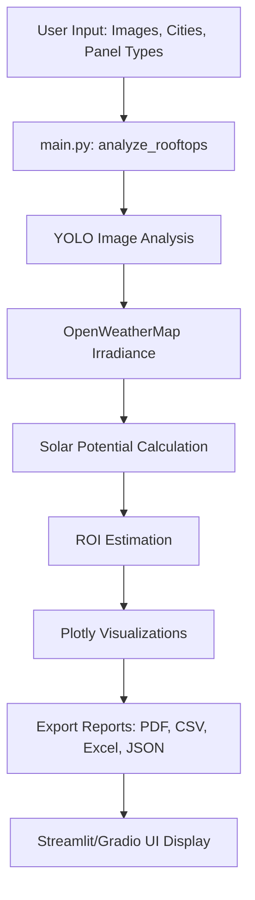

# Implementation Documentation: AI Solar Rooftop Analysis Tool
The AI Solar Rooftop Analysis Tool evaluates satellite images for solar potential, estimating energy output, ROI, and generating interactive visualizations and reports. It supports **Gradio** and **Streamlit** interfaces, utilizes **YOLO** for image analysis, and fetches irradiance data via **OpenWeatherMap** (with a fallback default).

## 🧱 Architecture

### `main.py`: Core Orchestration
- **Responsibilities**: Interface selection, image analysis workflow.
- **Key Functions**:
  - `analyze_rooftops(image_paths, cities, panel_types)`: Handles image analysis, energy and ROI estimates, visualization, and export.
  - `create_interface()`: Sets up the Gradio interface.
- **Launch Logic**: Chooses Streamlit (`--streamlit`) or Gradio based on `sys.argv`.

### `streamlit_app.py`: Streamlit Interface
- **UI Components**:
  - File uploader: `st.file_uploader`
  - Multiselects: Cities and panel types
  - Analysis button: Triggers `analyze_rooftops`
  - Result display: Text, Plotly charts, download buttons
- **Session State**: Manages:
  - Output summary
  - Charts (`bar_fig`, `line_fig`)
  - Export files (`PDF`, `CSV`, `Excel`, `JSON`)

### `test-main.py`: Testing
- **Unit Tests (6)**: Parsing, cost fetching, solar potential, ROI, visualizations, and UI.

---

## 🔄 Workflow

1. **Input**: User uploads images (>1080p; PNG/JPG/JPEG), selects cities and panel types.
2. **Image Analysis**: YOLO extracts rooftop features (area, orientation, obstructions).
3. **Solar Potential**: Uses OpenWeatherMap irradiance (default: 600 W/m² on failure).
4. **ROI Estimation**: Estimates system size, costs, savings, and payback period.
5. **Output**:
   - Interactive Plotly charts (bar, line)
   - Exportable reports: PDF, CSV, Excel, JSON

---

## 🔁 Flow Diagram


## 🌟 Key Features
- **Image Analysis**: `ultralytics.YOLO` for rooftop segmentation

- **Error Handling**:
  - Graceful API failure fallback
  - Invalid image detection
  - Runtime exception guards

- **Multi-format Exports**: Via `reportlab`, `pandas`, `openpyxl`

- **Scalability**: Unique temporary file naming per image for safe batch processing

## 🌐 OpenRouter API Proposal

**Purpose**: Enhance rooftop feature extraction using OpenRouter LLMs.

**Implementation**:
```python
from openrouter import OpenRouter
client = OpenRouter(api_key=os.getenv("OPENROUTER_API_KEY"))

def enhance_analysis(image_path: str) -> Dict:
    response = client.generate(f"Analyze rooftop image for solar potential: {image_path}")
    return response.json()
```
- **Integration Point:** Optional step in `analyze_rooftops` for supplementary analysis.
- **Status:** Not implemented (API key required)